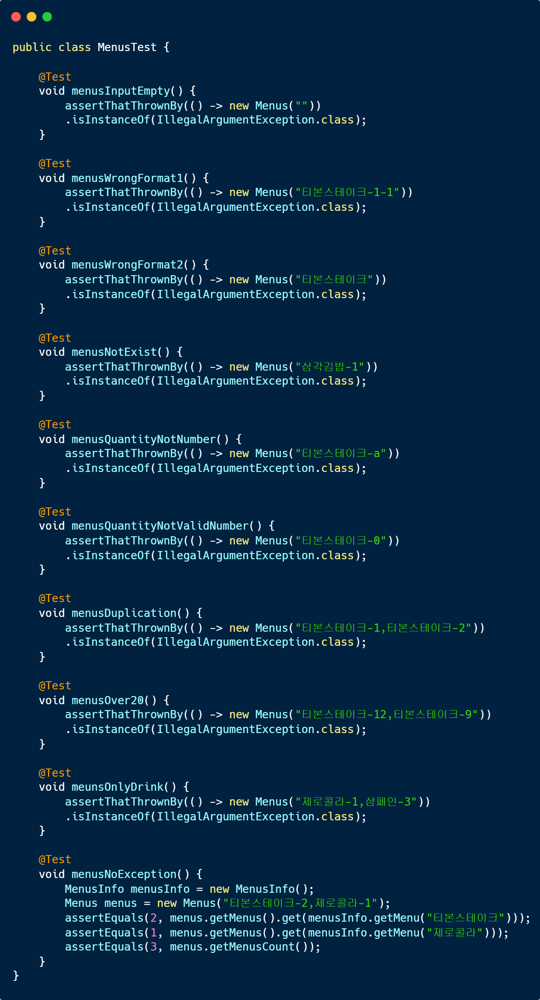

    

# 4주차 미션 - 크리스마스 프로모션
> 4주차 미션 크리스마스 프로모션을 구현한 저장소입니다.

    

## 목차
 - [실행하기](#실행하기)
 - [기능](#기능)
	- [시작](#시작)
	- [날짜 입력](#날짜-입력)
		- [예외 처리 - 날짜 입력](#예외-처리---날짜-입력)
	- [메뉴 받기](#메뉴-받기)
		- [예외 처리 - 메뉴 받기](#예외-처리---메뉴-받기)
	- [주문 종합 출력](#주문-종합-출력)

 

## 실행하기
비공개 미션이므로 github주소가 공개되어 있지 않습니다.
아이디/비밀번호 혹은 토큰없이 실행할 수 없습니다.
 

## 기능

### 시작
- 시작하면 `안녕하세요! 우테코 식당 12월 이벤트 플래너입니다.`가 출력됩니다.
- 이후 순서대로 기능이 실행됩니다.

### 날짜 입력
- `12월 중 식당 예상 방문 날짜는 언제인가요? (숫자만 입력해 주세요!)` 가 출력됩니다.
- 1 ~ 31의 수를 입력해야 합니다.
- 잘못된 입력을 한 경우 각각의 입력에 따라 `[ERROR]`로 시작되는 메세지가 출력되고 그 곳부터 다시 입력해야 합니다.

#### 예외 처리 - 날짜 입력
- 아무 입력도 하지 않는 경우를 예외 처리했습니다.
- 수가 아닌 입력을 하는 경우를 예외 처리했습니다.
- 1 ~ 31에 해당하지 않는 입력을 하는 경우를 예외 처리했습니다.

	

	
예외 처리 코드 보기

		
	

	

	
실행 결과 및 테스트 코드 보기

		
		
	

	
### 메뉴 받기
- `주문하실 메뉴를 메뉴와 개수를 알려 주세요. (e.g. 해산물파스타-2,레드와인-1,초코케이크-1)` 가 출력됩니다.
- 존재하는 메뉴를 형식에 맞게 `{메뉴}-{수량}`을 공백없이 쉼표(,)로 구분하여 입력해야 합니다.
- 잘못된 입력을 한 경우 각각의 입력에 따라 `[ERROR]`로 시작되는 메세지가 출력되고 그 곳부터 다시 입력해야 합니다.

#### 예외 처리 - 메뉴 받기
- 아무 입력도 하지 않는 경우를 예외 처리했습니다.
- 메뉴 형식이 예시와 다른 경우(eg. `{메뉴}-{수량}-{수량}` 혹은 `{메뉴}-` 등..)를 예외 처리했습니다.
- 존재하지 않는 메뉴명을 입력하는 경우를 예외 처리했습니다.
- 수량에 수가 아닌 입력하는 경우를 예외 처리했습니다.
- 수량에 0이나 음수를 입력하는 경우를 예외 처리했습니다.
- 중복 메뉴를 입력한 경우를 예외 처리했습니다.

	

	
예외 처리 코드 보기

		
	

	

	
실행 결과 및 테스트 코드 보기

		
		
	

### 주문 종합 출력
- 입력한 메뉴를 종합하여 각각의 정보를 출력합니다.
	- 주문메뉴
	- 할인 전 총 주문 금액
	- 증정 메뉴
	- 혜택 내역
	- 총 혜택 금액
	- 할인 후 예상 결제 금액
	- 12월 이벤트 배지

	

	